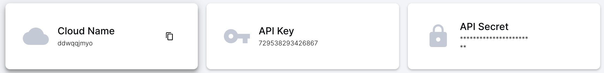

### All information about contributing will be avaliable within the docs folder!

### Getting Started

1) Make sure npm is installed

    ```npm install -g npm```
2) Clone or Fork the Repository

3) Make a Free Cloudinary Account and visit your dashboard. You should see 3 keys:
    
    You will need these later
4) Also make sure docker is installed and docker desktop is avaliable

### Setting up Frontend
1) Navigate to the Frontend Folder
    
    ```cd src/web```
2) Install packages

    ```npm i```
3) Create a new ```.env``` file and copy the contents of ```.env.example```

    On local branch:
    
    ``` VITE_SERVER_URL=http://localhost:1337 ```
    
    Docker exposes port 1337

    ```VITE_CLOUDINARY_CLOUD_NAME=```

    Cloud Name is your Cloudinary Cloud Name
4) Run the command ```npm run dev``` to start the server!

### Setting up Server
1) Navigate to the server folder

    ```cd src/api```
2) Create a new ```.env``` file and copy the contents of ```.env.example```

    On local branch:
    
    ```
    MONGO_URI
    ACCESS_TOKEN_SECRET
    REFRESH_TOKEN_SECRET
    EMAIL_USER
    EMAIL_PASSWORD
    EMAIL_DOMAIN
    GOOGLE_CLIENT_ID
    GOOGLE_CLIENT_SECRET
    ``` 
    doesnt matter

    The following below needs to be setup:
    ```
    PORT=1337
    CLOUDINARY_SECRET=[secret key]
    CLOUDINARY_CLOUD_NAME=[cloud name]
    CLOUDINARY_API_KEY=[api key]
    ```
3) Go back to the root repository and run

    ```docker compose up```
4) Now the database and server should be up and running!

### Happy Developing!

    